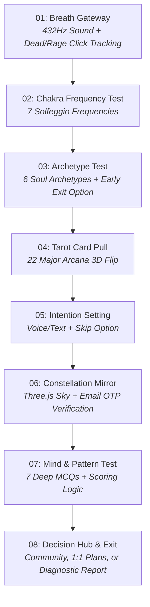
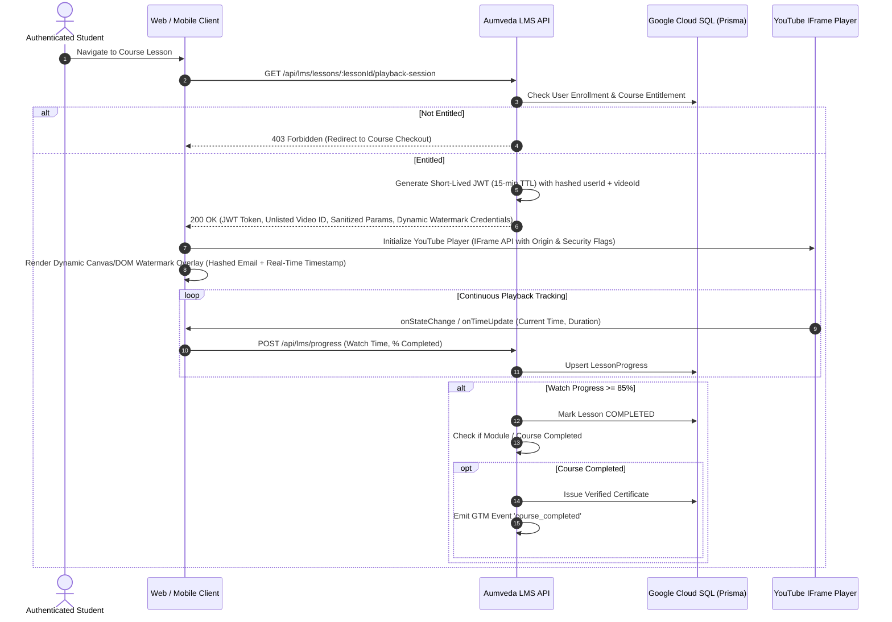
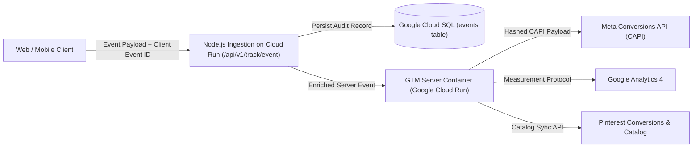
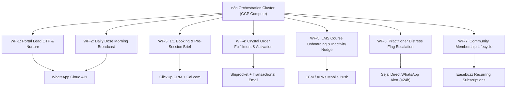

# AUMVEDA — MASTER PRODUCT REQUIREMENTS DOCUMENT (PRD v4.1)
**Neuro Astrologer — Decode. Dissolve. Return.**
*The Unified Technical, Product, Operational, LMS Academy & Behavioral Healing Specification*
*Updated Specification (Incorporating Stakeholder Annotations & PRD v3 Feedback) | October 2026 Target Launch*
*Confidential — Founding & Engineering Team*

---

## 1. Executive Summary & Brand Foundations

### 1.1 Brand Identity & Vision
**AUMVEDA** is an integrative digital healing sanctuary and neuro-astrology platform that bridges ancient Indian spiritual technologies (**Vedic Astrology / Jyotish, Vastu Shastra, Solfeggio Frequencies, Mantras, Mudras, Gemology**) with evidence-based Western neuroscience and psychology (**Somatic Experiencing, Polyvagal Nervous System Regulation, Trauma Release, Cognitive Behavioral Therapy / CBT**).

* **Brand Tagline**: *“The stars don't lie. It's time to return to who you always were.”*
* **Core Value Proposition**: Continuous, root-cause transformation. Rather than offering ephemeral horoscope entertainment or generic meditation timers, Aumveda operates as a clinically informed, spiritually anchored healing relationship.
* **The Co-Founders**:
  * **Archana Jain** (*Delhi*) — Co-Founder & Head of Vedic Wisdom. 25+ years of dedicated practice in Vedic Astrology, Vastu Shastra, Planetary Gemology, and Karmic Remediation. Crystals are personally selected, authenticated, and energized in Jaipur.
  * **Sejal Jain** (*Delhi*) — Co-Founder & Clinical Director. Certified Somatic Experiencing Practitioner, Nervous System Regulation Coach, Trauma Release Specialist, and Western Psychology Integrator.
* **Founders Positioning**: A mother-daughter duo uniting ancient ancestral lineage with modern neurobiology. Both founders are based in **Delhi**.

---

### 1.2 Target Audience & Demographic Expansion (+ Men Need It More)
While urban Indian women (25–45) naturally gravitate toward holistic wellness, the product positioning, messaging, and clinical pathways explicitly emphasize that **men need this work even more**. Men in high-pressure urban environments endure endemic silent burnout, suppressed emotional trauma, chronic stress hyperarousal, and somatic dissociation due to cultural conditioning against vulnerability.

Aumveda provides a grounded, non-stigmatized language (neurobiology, nervous system states, planetary blueprints, actionable discipline) that gives men full permission to heal without feeling categorized into generic therapy clichés.

| Persona Key | Archetype Name | Dominant Chakra Block | Psychological & Somatic Pattern | Male & Executive Manifestation | Core Healing Modality |
| :--- | :--- | :--- | :--- | :--- | :--- |
| **P1** | **The Anxious Achiever** | Solar Plexus (*Manipura*) & Root (*Muladhara*) | High-functioning anxiety, imposter syndrome, nervous system hyperarousal | 70-hour workweeks, chronic hypertension, perfectionist exhaustion | Somatic vagus down-regulation, Saturn-Rahu balancing, grounding rituals |
| **P2** | **The Frozen Heart** | Heart (*Anahata*) & Sacral (*Svadhisthana*) | Emotional numbness, avoidant attachment, fear of emotional intimacy | Inability to connect deeply in marriage/relationships, emotional shutdown | Heart-opening somatic tremors, Venus-Moon remediations, Rose Quartz activation |
| **P3** | **The Wounded Warrior** | Throat (*Vishuddha*) & Solar Plexus | Repressed anger, boundary issues, chronic burnout, people-pleasing fatigue | Uncontrolled explosive outbursts, irritability, digestive distress | Voice activation, Mars balancing, boundary breathwork, Tiger Eye therapy |
| **P4** | **The Silent Sufferer** | Third Eye (*Ajna*) & Root (*Muladhara*) | Chronic insomnia, bedtime rumination, cognitive dissociation | Night panic, excessive screen addiction, isolation from peer support | 528 Hz / 432 Hz Solfeggio sound therapy, Moon-Ketu harmonisation, sleep resets |
| **P5** | **The Lost Soul** | Crown (*Sahasrara*) & Throat | Existential dread, career disorientation, disconnection from purpose | Mid-career crisis, cynical detachment, loss of personal drive | Natal chart alignment, Jupiter re-centering, Clarity breathwork, Amethyst work |
| **P6** | **The Awakening One** | Multi-Chakra Integration | Active spiritual seeker desiring daily discipline and esoteric mastery | Seekers transitioning from intellectual knowledge to somatic embodiment | LMS Academy masterclasses, community circles, advanced shadow integration |

---

### 1.3 Key Milestones & Launch Schedule (Phase 1 Target: October 2026)
* **Phase 0 (MVP Portal & Verification)**: July 1 – August 15, 2026 (8-step portal, OTP verification, initial lead capture).
* **Phase 1 (AI Companion & Daily Dose)**: August 16 – September 15, 2026 (AHI engine, Sejal content buckets, practitioner oversight).
* **Phase 2 (LMS Academy & Courses)**: September 1 – September 25, 2026 (LMS platform, YouTube gating, student journey tracking).
* **Phase 3 (E-Commerce & 1:1 Booking)**: September 15 – October 10, 2026 (Crystal sanctuary, Easebuzz payments, Cal.com sync).
* **Phase 1 Target Launch**: **October 2026** — ₹500K MRR, 1,000 Portal completions, 100 Discovery Calls booked, 40 active service clients, 200 community members.

---

## 2. System Architecture & High-Level Topology

```mermaid
graph TD
    ClientWeb["Web Client (Next.js 14 App Router + TypeScript)"] --> CloudRun_GW["API Gateway / Node.js Microservice (Google Cloud Run)"]
    ClientApp["Mobile App (React Native / Expo EAS - iOS & Android)"] --> CloudRun_GW
    
    CloudRun_GW --> Auth["Auth & Email OTP Service (Resend / SendGrid + JWT)"]
    CloudRun_GW --> AHI["AHI Engine (Python FastAPI on Google Cloud Run)"]
    CloudRun_GW --> LMS["LMS Course & YouTube Entitlement Engine"]
    CloudRun_GW --> Shop["E-Commerce & Crystal Sanctuary Engine"]
    CloudRun_GW --> ServicesEngine["1:1 Practitioner Booking (Cal.com + Webhooks)"]
    CloudRun_GW --> HealthEngine["Health Integrations (Google Fit / Health Connect / HealthKit)"]
    
    CloudRun_GW --> DB[("Google Cloud SQL - Managed PostgreSQL (asia-south1)")]
    CloudRun_GW --> CloudStorage[("Google Cloud Storage / Cloudinary / Mux")]
    
    LMS --> YT[("YouTube Video Infrastructure (Unlisted / Secure Embed API)")]
    LMS --> WatermarkEngine["Client Forensic Dynamic Watermarking Layer"]
    
    CloudRun_GW --> PayGW["Easebuzz Payment Gateway (Primary India) + Razorpay"]
    CloudRun_GW --> GTM_Server["GTM Server-Side Container (Cloud Run - gtm.aumveda.com)"]
    
    GTM_Server --> MetaCAPI["Meta Conversions API (CAPI)"]
    GTM_Server --> GA4["Google Analytics 4 (Measurement Protocol)"]
    GTM_Server --> Pinterest["Pinterest Conversions & Catalog"]
    
    CloudRun_GW --> n8n["n8n Orchestration Cluster (Self-Hosted on GCP Compute)"]
    n8n --> WhatsApp["WhatsApp Cloud API (Meta Business API)"]
    n8n --> ClickUp["ClickUp Practitioner CRM"]
    n8n --> ConvertKit["Email Lifecycle & Nurture Engine"]
```



### 2.1 Core Infrastructure Pivot Summary
1. **Compute & Hosting — Google Cloud Run**:
   * Replaced third-party PaaS with Google Cloud Run containerized microservices for both Next.js 14 web client and Python FastAPI AHI backend.
   * Leverages automatic autoscaling (down to 0 instances when idle, rapidly scaling up during morning Daily Dose dispatch spikes).
   * Hosted in Google Cloud's India Region (**`asia-south1` Mumbai**) with global CDN edge acceleration.
2. **Database — Google Cloud SQL (PostgreSQL)**:
   * Replaced external hosted DB with enterprise-grade **Google Cloud SQL for PostgreSQL 16**.
   * Multi-AZ high availability with automated point-in-time recovery (PITR).
   * Connection pooling via PgBouncer / Prisma client connection management.
   * Encrypted at rest via Google Cloud Key Management Service (KMS) Customer-Managed Encryption Keys (CMEK).
3. **Payment Processor — Easebuzz**:
   * Easebuzz is designated as the primary payment gateway for domestic Indian transactions (handling UPI Intent, UPI AutoPay, Net Banking, Debit/Credit Cards, and EMI).
   * Full webhook HMAC-SHA512 verification, idempotency control, and automated refund management.
   * Fallback secondary gateway: Razorpay.
4. **Data Privacy & DPDP Act 2023 Compliance ("Check as per Google")**:
   * Strict adherence to Google Cloud India DPDP compliance guidelines.
   * All personally identifiable information (PII), birth coordinates, psychological test responses, and practitioner session notes reside exclusively inside Google Cloud India data centers (`asia-south1`).
   * Explicit unbundled consent capture, 72-hour automated right-to-erasure workflows, and granular role-based access control (RBAC).

---

## 3. Product Pillars & Functional Specifications

### Pillar 1: Onboarding & Interactive Diagnostic Portal (Enhanced 8-Step Ritual)



#### Detailed Step Specifications
* **Step 01 — Breath Gateway (Regulate. Arrive. Begin.)**:
  * *Experience*: Full-screen dark background (`#1A0F3C`), pulsating golden circle (`#C9A84C`), 432 Hz ambient tone. 3 guided inhale/exhale cycles.
  * *Behavioral Telemetry (Stakeholder Requirement)*: The front-end tracks user interaction cadence—including **dead clicks, rage clicks (rapid repeated clicking), cursor velocity, and dwell time**. This passive telemetry detects whether the user enters in a state of sympathetic hyperarousal (agitated/fast clicks) or dorsal vagal numbness (sluggish/hesitant movements), feeding this context forward to the AHI engine.
  * *Offline Fallback*: Zero network dependency; runs entirely in browser memory.
* **Step 02 — Chakra Frequency Test (Which chakra calls for healing?)**:
  * *Experience*: 7 interactive chakra orbs. Hover/touch plays pure Solfeggio frequency (396 Hz Muladhara to 963 Hz Sahasrara). Selection locks state and reveals block indicators.
* **Step 03 — Archetype Test (Who are you at soul level?)**:
  * *Experience*: 6 archetypes displayed as iconic cards (Warrior, Lover, Sage, Innocent, Caregiver, Creator).
  * *Proper Incentivisation & Early Exit (Stakeholder Requirement)*: Clear micro-copy communicates immediate value (*"Unlocking your archetype reveals your blind spot"*). Crucially, a **"Save & Continue Later" (Can exit here)** option is provided. If the user exits, their progress is persisted locally in `sessionStorage` / `IndexedDB` and linked to their session token without causing a hard funnel bounce.
* **Step 04 — Tarot Card Pull (What does the subconscious know?)**:
  * *Experience*: Shuffling deck of 22 Major Arcana cards. 3D card flip animation reveals card art and assigns 1 of 7 subconscious healing themes (Transformation, Awakening, Inner Work, Power & Will, Love & Relationships, Surrender, Purpose & Path).
* **Step 05 — Intention Setting (What are you here to heal?)**:
  * *Experience*: Styled reflection input. Voice dictation supported via Web Speech API alongside text input. "Continue quietly" skip option available.
* **Step 06 — Constellation Mirror & Email OTP Verification**:
  * *Inputs*: Date of Birth, Time of Birth ("I don't know" toggle), Place of Birth (Google Places Autocomplete).
  * *Astro Calculation*: Prokerala API / Swiss Ephemeris microservice calculates exact Sun, Moon, Rising signs, Nakshatra, and current planetary Dasha.
  * *Proper Data Collection & Email OTP (Stakeholder Requirement)*: Before unveiling the full constellation sky and planetary predictions, the user must provide their email and verify it via a **6-digit Email OTP** (`POST /api/v1/auth/email-otp/send` and `verify`). This guarantees authentic lead capture, eliminates invalid email entries, and establishes a secure DPDP-compliant user account.
* **Step 07 — Mind & Pattern Test (7 Psycho-Spiritual MCQs)**:
  * 7 targeted multi-choice questions assessing: Q1 Sleep, Q2 Mood, Q3 Nervous System Stress Response, Q4 Relationships, Q5 Finances, Q6 Parental Relationship, Q7 Childhood Atmosphere.
  * Evaluates nervous system state (Regulated, Anxious/Hyperactive, Shutdown, Fight), attachment style (Secure, People Pleasing, Avoidant, Repeating Patterns), and assigns 1 of 6 dominant profiles: *Anxious Achiever, Frozen Heart, Wounded Warrior, Silent Sufferer, Lost Soul, Awakening One*.
* **Step 08 — Decision Hub & Conversion Exit (Stakeholder Requirement)**:
  * Upon completing Step 7, rather than a single forced booking form, the user is presented with a clear **Triple-Pathway Decision Hub**:
    1. **Individual 1:1 Plans**: Direct booking for a 30-min Discovery Call or paid consultation with Sejal or Archana.
    2. **Community & Events**: Instant access to the Aumveda Community Circle, weekly live Zoom gatherings, and 7-day healing sprints.
    3. **Personalized Diagnostic Result Report**: Instant access to an in-depth, AHI-synthesized report detailing their chakra blocks, astrological patterns, and somatic roadmap.
* **Resilient Client-Side Fallback ("No Section Failure Halts Journey")**:
  * If network latency, API downtime, or Cloud SQL connectivity causes a persistence failure at any step, the portal client **MUST NEVER display a blocking error or interrupt the user ritual**.
  * The frontend automatically buffers all collected fields, answers, and telemetry in `IndexedDB` / `localStorage`, sets an `isOfflineSync = true` flag, and permits the user to transition smoothly to subsequent steps. An asynchronous background worker syncs the pending payload to `POST /api/v1/portal/sync-offline` once connectivity is re-established.

---

### Pillar 2: Daily Dose & AHI (AI Healing Intelligence)

#### "This Enables This" — Portal Data Parameterizes AHI
The diagnostic portal is not a marketing gimmick; every collected variable directly parameterizes the AHI context graph:
* Blocked Chakra $
ightarrow$ Selects primary energetic frequency and crystal alignment.
* Dominant Archetype $
ightarrow$ Sets conversational tone and shadow-work metaphors.
* Moon Sign & Planetary Dasha $
ightarrow$ Aligns emotional processing rhythm with Vedic cosmic cycles.
* Nervous System Score $
ightarrow$ Calibrates somatic practice intensity (e.g., gentle vagal reset for shutdown vs vigorous movement for fight response).

#### Sejal Content Buckets & Human-Curated Taxonomy
To ensure clinical integrity, the AI does **NOT** hallucinate healing exercises or advice:
* **Curated Content Buckets**: Sejal Jain builds and populates structured content libraries categorized by:
  * *Modality*: Somatic Tremoring, Vagus Nerve Reset, Diaphragmatic Breathwork, CBT Journaling, Mudra Meditation.
  * *State*: Acute Anxiety, Chronic Exhaustion, Emotional Numbness, Anger/Irritability, Existential Confusion.
  * *Duration*: 3 min (Micro), 7 min (Standard), 15 min (Deep Dive).
* **AHI Selection & Alignment**: The AHI engine queries these human-authored buckets, matching today's astrological weather and user profile to select the optimal dose.

#### Base Insights Scope & Human Approval Gates
* **Foundational Insights Only**: In strict alignment with ethical and AYUSH guidelines, AHI provides foundational root-cause insights and behavioral pattern decoding; it explicitly does **not** issue clinical medical diagnoses or replace licensed psychotherapy.
* **Usage Telemetry & AI Suggestion**: AHI continuously evaluates how the user interacts with the app (daily dose completion rate, journal sentiment, dwell time, rage click frequency). If engagement drops or distress patterns are detected, AHI flags the user on the Practitioner Dashboard and proposes an adjusted dose or check-in message.
* **Human Approval**: The practitioner reviews flagged profiles and retains 100% override authority over any automated recommendation.

#### Synthesized Diagnostic Result Report for Ambiguous Profiles
When a user's answers are conflicting, hesitant, or unclear (e.g., answering "Stable" on mood but selecting "Shutdown" in stress response), the AHI engine activates a **Diagnostic Synthesis Resolver**. It weighs the totality of responses alongside behavioral telemetry (hesitation dwell times) to produce a coherent, compassionate **Diagnostic Result Report** that illuminates the user's subconscious conflicts and provides actionable clarity.

---

### Pillar 3: Learning Management System (LMS) & Online Courses (Section 4.7)

#### Academy Architecture & YouTube Infrastructure
* **Online Course Engine**: Hosts structured psycho-spiritual masterclasses, video modules, guided audio meditations, downloadable reflection workbooks, and module assessments.
* **Cost-Effective Unlisted YouTube Delivery**: High-definition video playback hosted on YouTube as private unlisted assets. Secured via dynamic iframe origin locking and short-lived (15-minute) signed playback JWTs (`POST /api/v1/lms/lessons/:lessonId/playback-session`).
* **Forensic Dynamic Watermarking**: Prevents unauthorized screen recording by dynamically moving an unobtrusive semi-transparent watermark across the player window displaying the student's obfuscated email, user ID, and real-time timestamp.
* **Student Journey Tracking (Stakeholder Requirement)**:
  * Granular progress tracking per lesson (recording exact watch time and completion percentage).
  * Milestone unlocks: Lessons require $\ge 85\%$ completion and module quiz passage before advancing.
  * Interactive In-Lesson Journaling: Student reflections are saved directly to their personal journal and fed into the AHI context engine.
  * Automated Verifiable Certificate Generation: Dynamic PDF completion certificate signed by Archana & Sejal with verifiable QR code.

---

### Pillar 4: E-Commerce & Crystal Sanctuary
* **15–20 Ethically Sourced Gemstone SKUs**: Authenticated and energized in Jaipur by Archana Jain.
* **Profile-Matched Recommendations**: Dynamic dashboard widget: *"Your Heart Chakra is calling for balance — Rose Quartz is recommended for your profile."*
* **Cross-Sell Bundles**: "Crystal + 1:1 Healing Session" bundles integrated directly into the Easebuzz checkout flow to elevate Average Order Value (AOV).
* **Fulfillment**: Shiprocket integration with automated dispatch tracking and post-purchase cleansing ritual guides.

---

### Pillar 5: 1:1 Services & Practitioner Consultations
* **Practitioners**:
  * **Archana Jain** (Delhi): Vedic Astrology Reading (60 min), Vastu Residential / Commercial Consultation (90–120 min).
  * **Sejal Jain** (Delhi): Discovery Call (30 min, free), Somatic Healing Session (60 min), Trauma Release Session (90 min), 3-Session and 6-Session Mentorship Packages.
* **Automated Pre-Session Brief**: Cal.com webhook triggers AHI to synthesize the client's natal chart, portal responses, previous notes, and current daily dose streaks into a 1-page briefing note delivered to the practitioner's ClickUp CRM 30 minutes prior to the session.
* **Post-Session Loop**: Practitioner inputs session notes into the dashboard. Within 1 hour, AHI ingests the assigned homework and automatically updates the client's Daily Dose prescriptions for the next 7–14 days.

---

### Pillar 6: Community Circles & Live Events
* **Community Tiers**: Free tier (Daily Dose + Reel of the day + 1 live circle/mo) vs. Paid Tier (₹999/month: dual daily doses, all 4 monthly live Zoom circles, 7-day healing challenges, priority booking, and monthly crystal gift).
* **Weekly Live Gatherings**: Alternating fortnightly between Archana (Vedic planetary forecasts & Vastu rituals) and Sejal (Live somatic healing & trauma release exercises).

---

### Pillar 7: Health Integrations & Biometrics
* **Supported Ecosystems**: Google Fit REST API, Android Health Connect, iOS Apple HealthKit.
* **Privacy-First Scoring**: Ingests daily sleep, resting heart rate, HRV, and steps. Computes normalized composite wellness score ($P_t$), purging raw biometric payloads immediately after calculation.

---

## 4. Deep Dive: LMS & YouTube-Attached Course Platform (Section 4.7)



### 4.1 Architecture & Video Delivery Philosophy
1. **Cost-Effective Scalability**: High-definition video hosting without recurring per-gigabyte bandwidth fees or expensive multi-tier video transcoding bills. All academy lessons are securely hosted as **Unlisted / Domain-Restricted Videos on YouTube**.
2. **Multi-Layered Security & Anti-Piracy Deterrence**:
   * **Server-Side Tokenized Entitlement**: Direct YouTube URLs are never exposed in public endpoints or client markup. The client requests playback credentials via short-lived, signed tokens.
   * **Forensic Dynamic Watermarking**: The video player enforces an unobtrusive, dynamic watermark overlay displaying the logged-in student's hashed identifier, email snippet, IP location, and dynamic moving timestamp.
   * **IFrame Origin Locking & Interaction Shielding**: YouTube embed parameters are strictly hardened (`enablejsapi=1`, `origin=https://app.aumveda.com`, `rel=0`, `modestbranding=1`, `iv_load_policy=3`, `controls=1`, `disablekb=0`). Right-clicking, frame-stealing, and developer inspection triggers are actively neutralized.

---

### 4.2 Academy Course Hierarchy & Data Structure
* **Course Structure**:
  $$	ext{Course} \longrightarrow 	ext{Modules / Chapters} \longrightarrow 	ext{Lessons / Video Units} \longrightarrow 	ext{Reflective Journal Prompts} \longrightarrow 	ext{Quizzes / Assessments} \longrightarrow 	ext{Certification}$$
* **Launch Course Catalog**:
  1. **Foundations of Neuro-Astrology: Decoded** (12 Modules — Archana & Sejal Jain)
  2. **21-Day Somatic Nervous System Reset** (21 Daily Video Lessons + Breathwork Audio — Sejal Jain)
  3. **Vedic Vastu for Mental Clarity & Abundance** (8 Modules — Archana Jain)
  4. **Chakra Awakening & Sound Frequency Healing** (7 Modules — Archana & Sejal Jain)
  5. **Mastering Shadow Work & Karmic Dissolution** (Advanced 6-Week Cohort)

---

## 5. Complete Database Schema (Google Cloud SQL / PostgreSQL / Prisma)

```prisma
datasource db {
  provider = "postgresql"
  url      = env("DATABASE_URL")
}

generator client {
  provider = "prisma-client-js"
}

// ----------------------------------------------------
// AUTH, USERS & VERIFICATION
// ----------------------------------------------------

enum Role {
  USER
  PRACTITIONER
  ADMIN
}

model User {
  id                    String                 @id @default(uuid())
  email                 String                 @unique
  emailVerified         Boolean                @default(false)
  phone                 String?                @unique
  name                  String?
  avatarUrl             String?
  role                  Role                   @default(USER)
  createdAt             DateTime               @default(now())
  updatedAt             DateTime               @updatedAt

  profile               Profile?
  consents              Consent[]
  otpVerifications      OtpVerification[]
  telemetryLogs         InteractionTelemetry[]
  diagnosticResponses   DiagnosticResponse[]
  diagnosticReports     DiagnosticReport[]
  astroChart            AstroChart?
  dailyDoses            DailyDose[]
  dailyCompletions      DailyDoseCompletion[]
  journals              Journal[]
  healthMetrics         HealthMetric[]
  progressSnapshots     ProgressSnapshot[]
  courseEnrollments     CourseEnrollment[]
  lessonProgresses      LessonProgress[]
  quizSubmissions       QuizSubmission[]
  certificates          CourseCertificate[]
  reviews               CourseReview[]
  orders                Order[]
  serviceBookings       ServiceBooking[]
  circleMemberships     CircleMember[]
  circlePosts           CirclePost[]
  circleComments        CircleComment[]
  events                Event[]

  @@map("users")
}

model Profile {
  id                    String                 @id @default(uuid())
  userId                String                 @unique
  genderPreference      String?                // MALE, FEMALE, NON_BINARY
  timezone              String                 @default("Asia/Kolkata")
  currentPScore         Float                  @default(0.0)
  longestStreakDays     Int                    @default(0)
  createdAt             DateTime               @default(now())
  updatedAt             DateTime               @updatedAt

  user                  User                   @relation(fields: [userId], references: [id], onDelete: Cascade)

  @@map("profiles")
}

model OtpVerification {
  id                    String                 @id @default(uuid())
  userId                String?
  email                 String
  otpHash               String
  purpose               String                 @default("PORTAL_LEAD_VERIFY")
  attempts              Int                    @default(0)
  expiresAt             DateTime
  verifiedAt            DateTime?
  createdAt             DateTime               @default(now())

  user                  User?                  @relation(fields: [userId], references: [id], onDelete: Cascade)

  @@index([email, purpose])
  @@map("otp_verifications")
}

model Consent {
  id                    String                 @id @default(uuid())
  userId                String
  purpose               String                 // DATA_STORAGE, MARKETING_EMAIL, WHATSAPP, HEALTH_SYNC
  granted               Boolean                @default(false)
  ipAddress             String?
  userAgent             String?
  recordedAt            DateTime               @default(now())

  user                  User                   @relation(fields: [userId], references: [id], onDelete: Cascade)

  @@unique([userId, purpose])
  @@map("consents")
}

model InteractionTelemetry {
  id                    String                 @id @default(uuid())
  userId                String?
  sessionId             String
  stepNumber            Int                    // 1 to 8
  rageClicksCount       Int                    @default(0)
  deadClicksCount       Int                    @default(0)
  hesitationDwellMs     Int                    @default(0)
  cursorVelocityAvg     Float?
  inferredState         String?                // HYPERAROUSAL, SHUTDOWN, REGULATED
  payload               Json?
  createdAt             DateTime               @default(now())

  user                  User?                  @relation(fields: [userId], references: [id], onDelete: SetNull)

  @@index([sessionId, stepNumber])
  @@map("interaction_telemetry")
}

// ----------------------------------------------------
// DIAGNOSTIC PORTAL & AHI SYNTHESIS
// ----------------------------------------------------

model DiagnosticResponse {
  id                    String                 @id @default(uuid())
  userId                String
  chakraSelected        String                 // root, sacral, solar_plexus, heart, throat, third_eye, crown
  archetypeSelected     String                 // warrior, lover, sage, innocent, caregiver, creator
  tarotCard             String?
  tarotTheme            String?                // transformation, awakening, inner_work, power_will, etc.
  intentionText         String?
  q1Sleep               String?
  q2Mood                String?
  q3NervousSystem       String?
  q4Relationships       String?
  q5Finances            String?
  q6Parents             String?
  q7Childhood           String?
  computedNervousState  String?                // REGULATED, ANXIOUS, SHUTDOWN, FIGHT
  computedAttachment    String?                // SECURE, PEOPLE_PLEASING, AVOIDANT, REPEATING
  computedProfileResult String?                // anxious_achiever, frozen_heart, wounded_warrior, etc.
  isOfflineSync         Boolean                @default(false)
  clientRecordedAt      DateTime?
  portalCompletedAt     DateTime?
  createdAt             DateTime               @default(now())

  user                  User                   @relation(fields: [userId], references: [id], onDelete: Cascade)

  @@map("diagnostic_responses")
}

model DiagnosticReport {
  id                    String                 @id @default(uuid())
  userId                String
  reportSummary         String                 @db.Text
  dominantArchetype     String
  primaryChakraBlock    String
  nervousSystemBaseline String
  planetaryInfluences   String?
  claritySynthesis      String                 @db.Text
  initial30DayPlan      Json
  pdfUrl                String?
  generatedAt           DateTime               @default(now())

  user                  User                   @relation(fields: [userId], references: [id], onDelete: Cascade)

  @@map("diagnostic_reports")
}

model AstroChart {
  id                    String                 @id @default(uuid())
  userId                String                 @unique
  dateOfBirth           DateTime
  timeOfBirth           String?
  birthPlace            String
  latitude              Decimal                @db.Decimal(10, 7)
  longitude             Decimal                @db.Decimal(10, 7)
  sunSign               String
  moonSign              String
  risingSign            String?
  nakshatra             String?
  currentDasha          String?
  ephemerisPayload      Json?
  calculatedAt          DateTime               @default(now())

  user                  User                   @relation(fields: [userId], references: [id], onDelete: Cascade)

  @@map("astro_charts")
}

// ----------------------------------------------------
// SEJAL CONTENT BUCKETS & DAILY DOSE ENGINE
// ----------------------------------------------------

enum ModalityType {
  SOMATIC_TREMOR
  VAGUS_NERVE_RESET
  BREATHWORK
  CBT_REFRAME
  VEDIC_COSMIC_WEATHER
  CHAKRA_SOUND_HEALING
  VASTU_MICRO_HABIT
}

model ContentBucket {
  id                    String                 @id @default(uuid())
  title                 String
  modality              ModalityType
  targetNervousState    String                 // REGULATED, ANXIOUS, SHUTDOWN, FIGHT
  targetChakra          String?
  curatedBy             String                 @default("Sejal Jain")
  isActive              Boolean                @default(true)
  items                 BucketItem[]
  createdAt             DateTime               @default(now())

  @@map("content_buckets")
}

model BucketItem {
  id                    String                 @id @default(uuid())
  bucketId              String
  title                 String
  instructionText       String                 @db.Text
  audioUrl              String?
  durationSeconds       Int                    @default(180)
  affirmationSeed       String?
  journalPrompt         String?
  createdAt             DateTime               @default(now())

  bucket                ContentBucket          @relation(fields: [bucketId], references: [id], onDelete: Cascade)

  @@map("bucket_items")
}

model DailyDose {
  id                    String                 @id @default(uuid())
  userId                String
  scheduledDate         DateTime               @db.Date
  contentBucketItemId   String?
  title                 String
  modality              ModalityType
  audioUrl              String?
  affirmationText       String
  cbtReframeText        String
  actionPrompt          String
  durationSeconds       Int
  isPractitionerOverride Boolean               @default(false)
  overrideNotes         String?
  createdAt             DateTime               @default(now())

  user                  User                   @relation(fields: [userId], references: [id], onDelete: Cascade)
  completions           DailyDoseCompletion[]

  @@unique([userId, scheduledDate])
  @@map("daily_doses")
}

model DailyDoseCompletion {
  id                    String                 @id @default(uuid())
  dailyDoseId           String
  userId                String
  completedAt           DateTime               @default(now())
  timeSpentSeconds      Int
  reflectionNote        String?
  moodRating            Int?                   // 1 to 5

  dailyDose             DailyDose              @relation(fields: [dailyDoseId], references: [id], onDelete: Cascade)
  user                  User                   @relation(fields: [userId], references: [id], onDelete: Cascade)

  @@map("daily_dose_completions")
}

model Journal {
  id                    String                 @id @default(uuid())
  userId                String
  lessonId              String?
  entryText             String                 @db.Text
  sentimentScore        Float?
  keyThemes             String[]
  createdAt             DateTime               @default(now())

  user                  User                   @relation(fields: [userId], references: [id], onDelete: Cascade)

  @@map("journals")
}

model HealthMetric {
  id                    String                 @id @default(uuid())
  userId                String
  metricDate            DateTime               @db.Date
  sleepDurationMinutes  Int?
  deepSleepMinutes      Int?
  restingHeartRateBpm   Int?
  hrvMs                 Int?
  stepCount             Int?
  source                String                 // GOOGLE_FIT, HEALTH_CONNECT, APPLE_HEALTHKIT
  recordedAt            DateTime               @default(now())

  user                  User                   @relation(fields: [userId], references: [id], onDelete: Cascade)

  @@unique([userId, metricDate])
  @@map("health_metrics")
}

model ProgressSnapshot {
  id                    String                 @id @default(uuid())
  userId                String
  snapshotDate          DateTime               @db.Date
  progressScoreP        Float                  // Pt composite calculation
  currentStreakDays     Int
  totalCompletedDoses   Int
  calculatedAt          DateTime               @default(now())

  user                  User                   @relation(fields: [userId], references: [id], onDelete: Cascade)

  @@unique([userId, snapshotDate])
  @@map("progress_snapshots")
}

// ----------------------------------------------------
// LMS & ONLINE COURSE PLATFORM (SECTION 4.7)
// ----------------------------------------------------

enum CourseDifficulty {
  BEGINNER
  INTERMEDIATE
  ADVANCED
}

model Course {
  id                    String                 @id @default(uuid())
  title                 String
  slug                  String                 @unique
  headline              String
  description           String                 @db.Text
  instructorName        String
  thumbnailUrl          String
  previewVideoYtId      String?
  priceInr              Decimal                @db.Decimal(10, 2)
  durationHours         Float
  difficulty            CourseDifficulty       @default(BEGINNER)
  isPublished           Boolean                @default(false)
  createdAt             DateTime               @default(now())
  updatedAt             DateTime               @updatedAt

  modules               CourseModule[]
  enrollments           CourseEnrollment[]
  reviews               CourseReview[]
  certificates          CourseCertificate[]

  @@map("courses")
}

model CourseModule {
  id                    String                 @id @default(uuid())
  courseId              String
  title                 String
  orderIndex            Int
  description           String?
  createdAt             DateTime               @default(now())

  course                Course                 @relation(fields: [courseId], references: [id], onDelete: Cascade)
  lessons               CourseLesson[]
  quizzes               CourseQuiz[]

  @@map("course_modules")
}

model CourseLesson {
  id                    String                 @id @default(uuid())
  moduleId              String
  title                 String
  orderIndex            Int
  unlistedYoutubeId     String
  durationSeconds       Int
  isFreePreview         Boolean                @default(false)
  reflectionPrompt      String?
  resourcesPayload      Json?
  createdAt             DateTime               @default(now())

  module                CourseModule           @relation(fields: [moduleId], references: [id], onDelete: Cascade)
  progresses            LessonProgress[]

  @@map("course_lessons")
}

model LessonProgress {
  id                    String                 @id @default(uuid())
  userId                String
  lessonId              String
  watchTimeSeconds      Int                    @default(0)
  percentCompleted      Float                  @default(0)
  isCompleted           Boolean                @default(false)
  lastPlaybackPosition  Float                  @default(0)
  completedAt           DateTime?
  updatedAt             DateTime               @updatedAt

  user                  User                   @relation(fields: [userId], references: [id], onDelete: Cascade)
  lesson                CourseLesson           @relation(fields: [lessonId], references: [id], onDelete: Cascade)

  @@unique([userId, lessonId])
  @@map("lesson_progresses")
}

model CourseEnrollment {
  id                    String                 @id @default(uuid())
  userId                String
  courseId              String
  orderId               String?
  enrolledAt            DateTime               @default(now())
  progressPercent       Float                  @default(0)
  isCompleted           Boolean                @default(false)
  completedAt           DateTime?

  user                  User                   @relation(fields: [userId], references: [id], onDelete: Cascade)
  course                Course                 @relation(fields: [courseId], references: [id], onDelete: Cascade)

  @@unique([userId, courseId])
  @@map("course_enrollments")
}

model CourseQuiz {
  id                    String                 @id @default(uuid())
  moduleId              String
  title                 String
  passingScorePct       Int                    @default(80)
  questionsPayload      Json
  createdAt             DateTime               @default(now())

  module                CourseModule           @relation(fields: [moduleId], references: [id], onDelete: Cascade)
  submissions           QuizSubmission[]

  @@map("course_quizzes")
}

model QuizSubmission {
  id                    String                 @id @default(uuid())
  quizId                String
  userId                String
  scorePct              Int
  isPassed              Boolean
  submittedAnswers      Json
  attemptNumber         Int                    @default(1)
  submittedAt           DateTime               @default(now())

  quiz                  CourseQuiz             @relation(fields: [quizId], references: [id], onDelete: Cascade)
  user                  User                   @relation(fields: [userId], references: [id], onDelete: Cascade)

  @@map("quiz_submissions")
}

model CourseCertificate {
  id                    String                 @id @default(uuid())
  userId                String
  courseId              String
  certificateNumber     String                 @unique
  pdfUrl                String
  verificationHash      String                 @unique
  issuedAt              DateTime               @default(now())

  user                  User                   @relation(fields: [userId], references: [id], onDelete: Cascade)
  course                Course                 @relation(fields: [courseId], references: [id], onDelete: Cascade)

  @@map("course_certificates")
}

model CourseReview {
  id                    String                 @id @default(uuid())
  userId                String
  courseId              String
  rating                Int                    // 1 to 5
  reviewText            String?
  createdAt             DateTime               @default(now())

  user                  User                   @relation(fields: [userId], references: [id], onDelete: Cascade)
  course                Course                 @relation(fields: [courseId], references: [id], onDelete: Cascade)

  @@unique([userId, courseId])
  @@map("course_reviews")
}

// ----------------------------------------------------
// COMMERCE, PAYMENTS (EASEBUZZ) & SERVICES
// ----------------------------------------------------

enum OrderStatus {
  PENDING
  PAID
  FAILED
  REFUNDED
}

enum PaymentGateway {
  EASEBUZZ
  RAZORPAY
}

model Product {
  id                    String                 @id @default(uuid())
  name                  String
  slug                  String                 @unique
  chakraAssociation     String
  healingProperties     Json
  priceInr              Decimal                @db.Decimal(10, 2)
  stockQuantity         Int                    @default(0)
  weightGrams           Int?
  cloudinaryImageUrls   String[]
  isActive              Boolean                @default(true)
  createdAt             DateTime               @default(now())

  orderItems            OrderItem[]

  @@map("products")
}

model Order {
  id                    String                 @id @default(uuid())
  userId                String?
  totalAmountInr        Decimal                @db.Decimal(10, 2)
  taxAmountInr          Decimal                @db.Decimal(10, 2) @default(0)
  gateway               PaymentGateway         @default(EASEBUZZ)
  gatewayOrderId        String?
  easebuzzPaymentId     String?
  easebuzzTxnId         String?
  shippingAddress       Json?
  shiprocketOrderId     String?
  trackingNumber        String?
  status                OrderStatus            @default(PENDING)
  createdAt             DateTime               @default(now())
  updatedAt             DateTime               @updatedAt

  user                  User?                  @relation(fields: [userId], references: [id], onDelete: SetNull)
  items                 OrderItem[]

  @@map("orders")
}

model OrderItem {
  id                    String                 @id @default(uuid())
  orderId               String
  productId             String?
  itemType              String                 // CRYSTAL, COURSE, SERVICE_BUNDLE
  title                 String
  quantity              Int                    @default(1)
  unitPriceInr          Decimal                @db.Decimal(10, 2)

  order                 Order                  @relation(fields: [orderId], references: [id], onDelete: Cascade)
  product               Product?               @relation(fields: [productId], references: [id], onDelete: SetNull)

  @@map("order_items")
}

enum ServiceType {
  DISCOVERY_CALL
  VEDIC_ASTROLOGY
  VASTU_RESIDENTIAL
  VASTU_COMMERCIAL
  SOMATIC_HEALING
  TRAUMA_RELEASE
  DUAL_SYNERGY_SESSION
  THREE_MONTH_PACKAGE
}

enum BookingStatus {
  SCHEDULED
  CONFIRMED
  COMPLETED
  RESCHEDULED
  CANCELLED
}

model ServiceBooking {
  id                    String                 @id @default(uuid())
  userId                String
  serviceType           ServiceType
  practitionerName      String                 // Archana Jain or Sejal Jain
  scheduledAt           DateTime
  durationMinutes       Int
  calEventId            String?
  googleMeetLink        String?
  gatewayOrderId        String?
  easebuzzPaymentId     String?
  amountPaidInr         Decimal                @db.Decimal(10, 2) @default(0)
  status                BookingStatus          @default(SCHEDULED)
  preSessionBriefPayload Json?
  practitionerNotes     String?                @db.Text
  assignedHomework      String[]
  distressFlagRaised    Boolean                @default(false)
  createdAt             DateTime               @default(now())

  user                  User                   @relation(fields: [userId], references: [id], onDelete: Cascade)

  @@map("service_bookings")
}

// ----------------------------------------------------
// COMMUNITY & AUDIT EVENTS
// ----------------------------------------------------

model CommunityCircle {
  id                    String                 @id @default(uuid())
  name                  String
  slug                  String                 @unique
  description           String
  iconUrl               String?
  createdAt             DateTime               @default(now())

  members               CircleMember[]
  posts                 CirclePost[]

  @@map("community_circles")
}

model CircleMember {
  id                    String                 @id @default(uuid())
  circleId              String
  userId                String
  tier                  String                 @default("FREE") // FREE or PAID
  joinedAt              DateTime               @default(now())

  circle                CommunityCircle        @relation(fields: [circleId], references: [id], onDelete: Cascade)
  user                  User                   @relation(fields: [userId], references: [id], onDelete: Cascade)

  @@unique([circleId, userId])
  @@map("circle_members")
}

model CirclePost {
  id                    String                 @id @default(uuid())
  circleId              String
  userId                String
  title                 String
  body                  String                 @db.Text
  createdAt             DateTime               @default(now())

  circle                CommunityCircle        @relation(fields: [circleId], references: [id], onDelete: Cascade)
  user                  User                   @relation(fields: [userId], references: [id], onDelete: Cascade)
  comments              CircleComment[]

  @@map("circle_posts")
}

model CircleComment {
  id                    String                 @id @default(uuid())
  postId                String
  userId                String
  body                  String                 @db.Text
  createdAt             DateTime               @default(now())

  post                  CirclePost             @relation(fields: [postId], references: [id], onDelete: Cascade)
  user                  User                   @relation(fields: [userId], references: [id], onDelete: Cascade)

  @@map("circle_comments")
}

model Event {
  id                    String                 @id @default(uuid())
  userId                String?
  eventName             String
  eventPayload          Json
  clientEventId         String?
  ipAddress             String?
  userAgent             String?
  createdAt             DateTime               @default(now())

  user                  User?                  @relation(fields: [userId], references: [id], onDelete: SetNull)

  @@index([eventName, createdAt])
  @@map("events")
}
```

---

## 6. Core API Endpoint Contract & OpenAPI Specification

### 6.1 Authentication & Lead OTP Endpoints
* `POST /api/v1/auth/email-otp/send` — Dispatch 6-digit verification code to user email during Step 6 of portal. Rate-limited to 3 requests per 10 minutes.
* `POST /api/v1/auth/email-otp/verify` — Verify OTP, upsert `User`, issue signed JWT session cookie, and unlock astrological chart calculation.
* `POST /api/v1/auth/google` — Exchange Google ID token, upsert user profile, return JWT.
* `GET  /api/v1/profile/me` — Return user profile, archetype, dominant chakra, current streak, and progress score ($P_t$).
* `POST /api/v1/profile/consents` — Ingest unbundled DPDP consent preferences (Data Storage, Marketing, WhatsApp, Health Sync).

### 6.2 Diagnostic Portal & Offline Sync Endpoints
* `POST /api/v1/diagnostic/submit-step` — Incrementally submit answer for a portal step.
* `POST /api/v1/portal/sync-offline` — Bulk synchronization endpoint for client-cached steps buffered in `IndexedDB` when network recovers.
* `POST /api/v1/diagnostic/calculate` — Execute Vedic astrological ephemeris calculation (Prokerala API), compute psychological dimensions, assign primary profile.
* `POST /api/v1/diagnostic/report` — Generate comprehensive AHI Diagnostic Result Report (synthesizing conflicting or ambiguous answers into clear narrative guidance).
* `POST /api/v1/telemetry/interaction` — Ingest behavioral telemetry (rage clicks, dead clicks, dwell times) to determine real-time user mood state.

### 6.3 Daily Dose & AHI Companion Endpoints
* `GET  /api/v1/daily-dose/today` — Retrieve today's personalized dose from Sejal's aligned content buckets.
* `POST /api/v1/daily-dose/complete` — Record completion, reflection note, and mood rating. Recalculates streak and $P_t$.
* `GET  /api/v1/practitioner/dashboard` — Practitioner admin view: client roster, distress alerts, upcoming bookings, and dose override controls.
* `POST /api/v1/practitioner/override-dose` — Manually assign custom daily doses following a 1:1 session.

### 6.4 LMS & YouTube Course Academy Endpoints (Section 4.7)
* `GET  /api/v1/lms/courses` — Public catalog of all published courses with duration, instructor, and price.
* `GET  /api/v1/lms/courses/:slug` — Syllabus, previews, reviews, and student enrollment status.
* `POST /api/v1/lms/lessons/:lessonId/playback-session` — **Secure Playback Gating**. Validates student entitlement; generates 15-minute expiring JWT, returns unlisted YouTube ID, player flags, and student dynamic watermark credentials.
* `POST /api/v1/lms/progress` — Ingest video watch time, update percentage completed, mark lesson finished ($\ge 85\%$).
* `POST /api/v1/lms/quizzes/:quizId/submit` — Submit quiz answers; validates pass threshold and unlocks subsequent module.
* `GET  /api/v1/lms/courses/:courseId/certificate` — Fetch verifiable cryptographic PDF completion certificate.

### 6.5 Commerce, Booking & Easebuzz Payment Endpoints
* `POST /api/v1/checkout/create-order` — Create order for crystals, courses, or session deposits.
* `POST /api/v1/payments/easebuzz/create-session` — Initialize Easebuzz transaction token with order metadata.
* `POST /api/v1/payments/easebuzz/webhook` — Process Easebuzz payment callbacks with strict HMAC-SHA512 checksum validation.
* `POST /api/v1/services/book` — Reserve 1:1 slot with Archana or Sejal (synced with Cal.com and Google Meet).

---

## 7. Server-Side Tracking & GTM Server Architecture

### 7.1 Data Pipeline & Attribution
To guarantee privacy compliance (DPDP Act 2023 / GDPR) and circumvent client-side ad blockers, all user actions pass through an append-only `events` database table in Google Cloud SQL before being routed to a dedicated **Google Tag Manager (GTM) Server Container** hosted on **Google Cloud Run** at `gtm.aumveda.com`.



### 7.2 Core Event Taxonomy

| Event Name | Trigger Condition | Key Enriched Parameters | Downstream Destinations |
| :--- | :--- | :--- | :--- |
| `portal_step_completed` | User completes any step 1–8 | `step_number`, `dwell_time_ms`, `is_offline_sync` | GA4 |
| `portal_rage_click` | Rapid clicks detected ($\ge 3$ within 1s) | `step_number`, `element_selector`, `inferred_state` | GA4 |
| `email_otp_verified` | Lead verifies 6-digit OTP at Step 6 | `email_domain`, `otp_latency_sec` | GA4, Meta CAPI |
| `portal_completed` | User finishes Step 8 and chooses path | `archetype`, `dominant_chakra`, `chosen_path` | GA4, Meta CAPI |
| `daily_dose_completed`| User finishes daily micro-practice | `daily_dose_id`, `streak_count`, `mood_rating` | GA4 |
| `course_enrolled` | Course payment verified via Easebuzz | `course_id`, `order_id`, `price_inr`, `currency` | GA4, Meta CAPI, Pinterest |
| `lesson_completed` | Student watches $\ge 85\%$ of video | `course_id`, `lesson_id`, `watch_time_sec` | GA4 |
| `purchase` | Crystal order or Service deposit paid | `order_id`, `items`, `total_amount_inr`, `gateway` | GA4, Meta CAPI, Pinterest |

---

## 8. n8n Automation Workflows & Lifecycle Communications



* **WF-1 (Portal Lead OTP & Nurture)**: Triggers on Step 6 email submission to dispatch OTP via transactional email API. Upon completion of Step 8, generates personalized PDF summary and initiates a 5-day educational nurture sequence via WhatsApp.
* **WF-2 (Daily Dose Morning Broadcast)**: Runs daily at 05:45 AM IST. Pulls personalized prescription from Sejal's content buckets via AHI, formats rich WhatsApp message with playable audio snippet, and delivers to opted-in users.
* **WF-3 (1:1 Service Booking Sync)**: Triggered on Cal.com appointment confirmation. Compiles user's natal chart, dasha period, and diagnostic answers into a 1-page **Pre-Session Brief** delivered to Archana / Sejal 30 minutes before the call in ClickUp.
* **WF-4 (Crystal Shop Fulfillment & Activation)**: Triggered on `Order.status = PAID` via Easebuzz. Dispatches order to Shiprocket warehouse API, and emails the buyer their personalized **Crystal Cleansing & Activation Ritual** customized to their birth chart.
* **WF-5 (LMS Course Engagement & Re-activation)**: Monitors student lesson progress. If a student stalls for $>4$ days midway through a course, dispatches an encouraging voice memo from Sejal Jain nudging them back to their somatic integration.
* **WF-6 (Practitioner Distress Flag Escalation)**: If a client's daily dose completion falls below 30% for 5 consecutive days or high rage-click agitation is logged, generates a priority escalation alert to Sejal's phone to trigger a compassionate personal check-in.

---

## 9. Security, Data Privacy & DPDP Act 2023 Compliance ("Check as per Google")

Following enterprise Google Cloud security blueprints and India's DPDP Act 2023:
1. **Data Sovereignty & Residency**:
   * All database instances (Google Cloud SQL) and storage buckets reside strictly in Google Cloud's India regions (**`asia-south1` Mumbai** or **`asia-south2` Delhi**). Zero health or astrological profile data leaves Indian jurisdiction.
2. **Encryption & Key Management**:
   * All database tables, backups, and storage buckets are encrypted at rest using Google Cloud Key Management Service (KMS) with Customer-Managed Encryption Keys (CMEK).
   * Enforce TLS 1.3 in transit across all Google Cloud Run services.
3. **Granular Consent & Opt-In Architecture**:
   * Unbundled, explicit checkboxes at Step 6 email verification: (1) Storage of psycho-spiritual healing profile, (2) WhatsApp / email updates.
   * Granular consent dashboard in user settings.
4. **Right to Erasure & Data Anonymization**:
   * Automated self-serve account deletion (`DELETE /api/v1/profile/me`). Purges all PII, natal chart coordinates, and session notes within 72 hours, maintaining only anonymized aggregate metrics.
5. **Least-Privilege IAM & Role-Based Security**:
   * Practicing healers (Archana & Sejal) access only their assigned clients' briefing notes. Full admin permissions restricted to core engineering administrators.

---

## 10. Phased Implementation Roadmap (Target Launch: October 2026)

| Phase | Milestone Name | Timeline | Core Deliverables | Success Metrics |
| :--- | :--- | :--- | :--- | :--- |
| **0** | **Portal MVP & Verification** | Jul 1 – Jul 28, 2026 | 8-step Next.js portal, Three.js star map, Prokerala API, **Email OTP verification**, **offline-first IndexedDB fallback**, telemetry tracker | 200 portal completions, 100 verified emails, 0 fatal UI crashes |
| **1** | **AHI Engine & Daily Dose** | Jul 29 – Aug 20, 2026 | Python FastAPI microservice on Google Cloud Run, Sejal content buckets, morning WhatsApp delivery via n8n, Practitioner Dashboard | 100 active daily dose recipients, >80% dose completion rate |
| **2** | **LMS Academy & Video Gating** | Aug 21 – Sep 10, 2026 | Course catalog, YouTube unlisted player with 15-min JWT gating, dynamic forensic watermarking, student journey tracking, quizzes | 3 masterclasses live, zero unauthorized link leaks |
| **3** | **Commerce & Easebuzz Integration** | Sep 11 – Sep 30, 2026 | 15–20 crystal SKUs from Jaipur, Easebuzz payment integration, Cal.com 1:1 booking sync, Shiprocket fulfillment | ₹1.5L test revenue, 100% webhook verification pass rate |
| **4** | **Target Launch & Scale** | **October 2026** | Public commercial rollout, influencer Reels integration, community paid tier (₹999/mo), paid marketing scale | ₹500K MRR, 1,000 portal completions, 40 service clients |

---

## 11. Business Model & Financial Unit Economics

| Revenue Stream | Offering Description | Price Point (INR) | Gross Margin | Projected M3 Volume | Projected M3 Revenue |
| :--- | :--- | :--- | :--- | :--- | :--- |
| **1:1 Sessions** | Vedic Astrology (Archana) / Somatic Healing (Sejal) | ₹3,500 – ₹6,000 | ~85% | 40 sessions | ₹2,00,000 |
| **Mentorship Packages** | 3-Session / 6-Session Transformational Bundles | ₹10,500 – ₹19,500 | ~85% | 10 packages | ₹1,50,000 |
| **Online Courses (LMS)** | Self-Paced Psycho-Spiritual Masterclasses | ₹1,999 – ₹4,999 | ~95% | 50 course sales | ₹1,50,000 |
| **Community Circles** | VIP Healing Membership (Live circles + dual doses) | ₹999 / month | ~90% | 200 subscribers | ₹1,99,800 |
| **Crystal Sanctuary** | Authentic Jaipur-Energized Healing Crystals | ₹800 – ₹3,500 avg | ~55% | 80 orders | ₹1,44,000 |
| **Total Projected MRR** | — | — | **~82% Blended** | — | **₹8,43,800 / month** |

---

## 12. Launch Verification & Acceptance Checklist

* [ ] **Email OTP Verification**: Verified that unverified emails cannot access the constellation chart; OTP codes expire in 10 minutes; brute-force protection locks after 3 incorrect attempts.
* [ ] **Resilient Offline Fallback**: Simulated network termination at Steps 2, 4, and 6; verified that the UI does not break, state persists in `IndexedDB`, and background sync successfully flushes to Cloud SQL upon reconnect.
* [ ] **Behavioral Telemetry**: Confirmed that dead clicks and rage clicks are properly categorized without impacting UI frame rates.
* [ ] **Easebuzz Webhook Idempotency**: Dispatched duplicated Easebuzz webhook payloads; verified order status and entitlements update exactly once.
* [ ] **LMS Forensic Dynamic Watermarking**: Verified dynamic moving watermark rendering across desktop and mobile screens; confirmed that unlisted YouTube IDs are never visible in client HTML.
* [ ] **Google Cloud Data Sovereignty**: Validated that all Cloud SQL, Cloud Run, and Cloud Storage instances are locked to the Mumbai `asia-south1` region.
* [ ] **AHI Content Bucket Alignment**: Confirmed that AHI recommendations strictly map to Sejal's predefined content buckets without generating hallucinated exercises.

---
*AUMVEDA Master Product Requirements Document v4.1 — Final Engineering Specification.*
