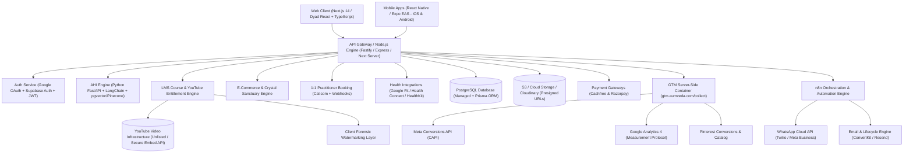
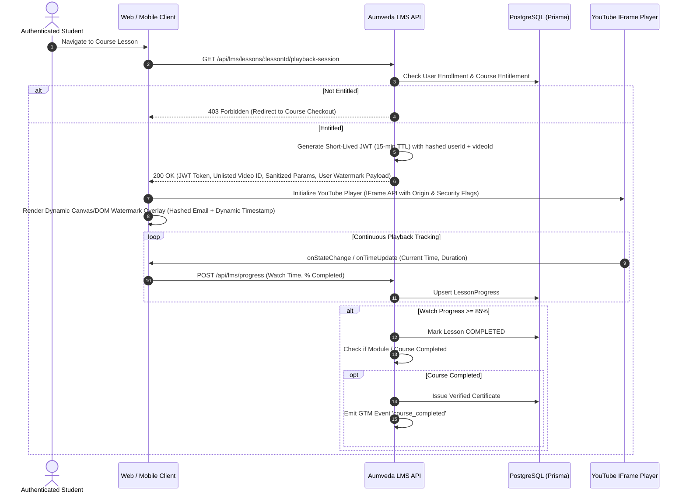
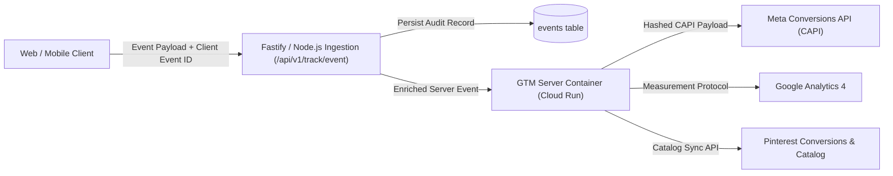
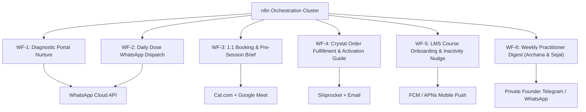
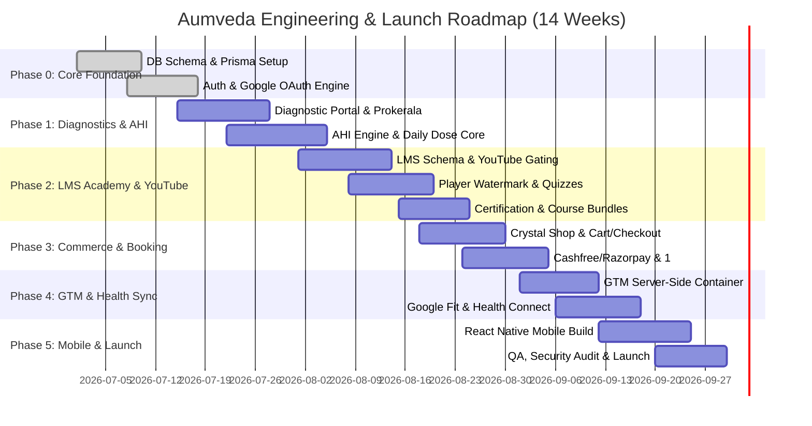

# AUMVEDA — MASTER PRODUCT REQUIREMENTS DOCUMENT (PRD v4.0)
**Neuro Astrologer — Decode. Dissolve. Return.**
*The Unified Technical, Product, Operational & Learning Academy Specification*
*June 2026 | Confidential — Founding & Engineering Team*

---

## 1. Executive Summary & Brand Foundations

### 1.1 Brand Identity & Vision
**AUMVEDA** is an integrative digital healing ecosystem and neuro-astrology platform that unites ancient Eastern wisdom (**Vedic Astrology / Jyotish, Vastu Shastra, Sound & Solfeggio Frequencies, Mantras, Mudras**) with modern Western evidence-based psychology (**Somatic Trauma Release, Polyvagal Nervous System Regulation, Cognitive Behavioral Therapy / CBT**).

* **Brand Tagline**: *“The stars don't lie. It's time to return to who you always were.”*
* **Core Value Proposition**: Personalised, root-cause healing. Instead of offering generic wellness or disconnected horoscope entertainment, Aumveda operates as a digital sanctuary providing a continuous, clinically informed, spiritually resonant healing relationship.
* **The Founders**:
  * **Archana Jain** (*Jaipur*) — Co-Founder & Head of Vedic Wisdom. 25+ years of clinical practice in Vedic Astrology, Vastu Shastra, Planetary Gemology, and Karmic Remediation.
  * **Sejal Jain** (*Mumbai*) — Co-Founder & Product Face. Certified Somatic Experiencing Practitioner, Nervous System Regulation Coach, Trauma Release Specialist, and Western Psychology integrator.

---

### 1.2 Target Audience & Core Personas
Aumveda is crafted for high-performing, introspective urban professionals (aged 25–45, predominantly women) seeking deep root-cause transformation for anxiety, burnout, relationship cycles, somatic tension, and ancestral conditioning.

| Persona Key | Archetype Name | Dominant Chakra Block | Psychological Pattern | Core Need / Preferred Modality |
| :--- | :--- | :--- | :--- | :--- |
| **P1** | **The Anxious Achiever** | Solar Plexus (*Manipura*) & Root (*Muladhara*) | High functioning anxiety, perfectionism, fear of failure, nervous system hyperarousal | Somatic grounding, nervous system down-regulation, Saturn-Rahu balancing, Root chakra crystal rituals |
| **P2** | **The Frozen Heart** | Heart (*Anahata*) & Sacral (*Svadhisthana*) | Emotional numbness, avoidant attachment, fear of vulnerability, grief retention | Heart-opening somatic shaking, Venus-Moon remediations, Rose Quartz activation, grief journal prompts |
| **P3** | **The Wounded Warrior** | Throat (*Vishuddha*) & Solar Plexus | Repressed anger, boundary issues, people-pleasing fatigue, chronic exhaustion | Voice activation, Mars balancing, boundary somatic breathwork, Tiger Eye & Carnelian therapy |
| **P4** | **The Silent Sufferer** | Third Eye (*Ajna*) & Root (*Muladhara*) | Overthinking, insomnia, dissociative anxiety, chronic stress fatigue | Sleep sound therapy (528 Hz / 432 Hz), Moon-Ketu harmonisation, bedtime somatic resets |
| **P5** | **The Lost Soul** | Crown (*Sahasrara*) & Throat | Existential dread, career disorientation, lack of purpose, disconnected intuition | Astrological birth chart decoding, Jupiter realignment, Clarity breathwork, Amethyst focus |
| **P6** | **The Awakening One** | Multi-Chakra Integration | Active spiritual seeker desiring structured daily discipline and advanced esoteric knowledge | Comprehensive LMS Academy courses, community circles, advanced astrology & shadow work |

---

## 2. System Architecture & High-Level Topology



---

## 3. Product Pillars & Functional Specifications

### Pillar 1: Onboarding & Interactive Diagnostic Portal
* **8-Step Multimodal Diagnostic**: Collects exact birth data (Date, Time, City, Coordinates via Google Places API) and evaluates 8 astro-psychological markers (Sleep, Emotional Triggers, Relationship Attachments, Nervous System State, Financial Mindset, Somatic Symptoms).
* **Birth Chart Calculation**: Instant ephemeris calculation via Prokerala API / Swiss Ephemeris microservice (Ascendant, Moon Sign, Sun Sign, Nakshatra, Dasha period, planetary placements).
* **Diagnostic Output**: Generates a dynamic **Personal Diagnostic Profile** displaying:
  * Primary Astro-Somatic Archetype.
  * Dominant Chakra Imbalance and Nervous System State (Ventral, Sympathetic, Dorsal Vagal).
  * 30-Day Personalized Daily Dose Plan.
  * Recommended LMS Courses, Curated Healing Crystals, and 1:1 Consultation tracks.

---

### Pillar 2: Daily Dose & AHI (Aumveda Healing Intelligence)
* **Daily Micro-Intervention Engine**: Generates a customized 3-to-5 minute daily healing prescription delivered at 6:00 AM user local time via App Push Notification and WhatsApp.
* **4 Multi-Sensory Components**:
  1. **Vibrational Audio**: 60–180 second curated sound frequency (e.g., 528 Hz DNA repair, 432 Hz alpha relaxation, 396 Hz root grounding) or guided somatic breathwork audio by Sejal Jain.
  2. **Subconscious Seed Affirmation**: 1-line cognitive anchor designed for neuroplastic reprogramming.
  3. **Cognitive CBT Reframe**: Astrologically and psychologically contextualized daily reflection prompt.
  4. **Micro-Habit / Vastu Action**: 60-second environmental alignment or physical somatic shake.
* **Progress Score ($P_t$) & Streaks**: Normalized wellness metric tracking daily consistency:
  $$P_t = 0.35 S_t + 0.30 A_t + 0.25 J_t + 0.10 W_t$$
  Where $S_t$ = Sleep Score, $A_t$ = Activity Score, $J_t$ = Journaling/Daily Dose completion, $W_t$ = Subjective Wellbeing Rating.

---

### Pillar 3: Learning Management System (LMS) & YouTube-Attached Course Academy
*(Full dedicated specification in Section 4)*

---

### Pillar 4: E-Commerce & Crystal Sanctuary
* **15–20 Ethically Sourced Healing Crystal SKUs** curated and energized by Archana Jain.
* **Product Detail Features**: Energetic frequency, chakra resonance, astrological planetary ruler, elemental association, physical origin, authentic energization ritual instructions, and 3D crystal preview.
* **Checkout Engine**: Unified cart supporting combined purchases of physical crystals, digital LMS courses, and 1:1 service deposits with automated GST tax calculation and Cashfree/Razorpay payment routing.

---

### Pillar 5: 1:1 Services & Practitioner Booking
* **Service Offerings**:
  1. *Neuro-Astrology Deep Dive* (60 min with Archana Jain).
  2. *Somatic Trauma & Nervous System Release* (60 min with Sejal Jain).
  3. *The Dual Synergy Session* (90 min co-facilitated by Archana & Sejal).
  4. *3-Month Intensive Mentorship* (6 bi-weekly sessions + ongoing WhatsApp voice notes).
* **Automated Practitioner Workflow**: Integrated with Cal.com API, automated pre-session diagnostic summaries prepared by AHI, secure Google Meet generation, and post-session prescription notes.

---

### Pillar 6: Community Circles & Growth Loops
* **Circles**: Themed micro-communities (e.g., *Moon Manifestation Circle*, *Somatic Nervous System Healers*, *Vedic Vastu Living*).
* **Lunar Rituals**: Bi-weekly live interactive gatherings (New Moon intention setting & Full Moon somatic release).
* **Gamification & Rewards**: Badges (*7-Day Streak*, *Chakra Alchemist*, *Academy Scholar*), unlocking community discounts and exclusive audio meditations.

---

### Pillar 7: Health Integrations & Biometrics
* **Supported Ecosystems**: Google Fit REST API, Android Health Connect native bridge, iOS Apple HealthKit native bridge.
* **Zero-PII Derived Metrics**: Reads daily sleep duration, deep sleep %, resting heart rate, HRV (Heart Rate Variability), and daily steps. Raw biometric data is purged after computing normalized aggregate scores ($S_t, A_t$).

---

## 4. Deep Dive: LMS & YouTube-Attached Course Platform



### 4.1 Architecture & Video Delivery Philosophy
1. **Cost-Effective Scalability**: High-definition video hosting without recurring per-gigabyte bandwidth fees or expensive multi-tier video transcoding bills. All academy lessons are securely hosted as **Unlisted / Domain-Restricted Videos on YouTube**.
2. **Multi-Layered Security & Anti-Piracy Deterrence**:
   * **Server-Side Tokenized Entitlement**: Direct YouTube URLs are never exposed in public endpoints or client markup. The client requests playback credentials via short-lived, signed tokens.
   * **Forensic Dynamic Watermarking**: The video player enforces an unobtrusive, dynamic watermark overlay displaying the logged-in student's hashed identifier, email snippet, IP location, and dynamic moving timestamp.
   * **IFrame Origin Locking & Interaction Shielding**: YouTube embed parameters are strictly hardened (`enablejsapi=1`, `origin=https://app.aumveda.com`, `rel=0`, `modestbranding=1`, `iv_load_policy=3`, `controls=1`, `disablekb=0`). Right-clicking, frame-stealing, and developer inspection triggers are actively neutralized.

---

### 4.2 Academy Course Hierarchy & Data Structure
* **Course Structure**:
  $$\text{Course} \longrightarrow \text{Modules / Chapters} \longrightarrow \text{Lessons / Video Units} \longrightarrow \text{Reflective Journal Prompts} \longrightarrow \text{Quizzes / Assessments} \longrightarrow \text{Certification}$$
* **Launch Course Catalog**:
  1. **Foundations of Neuro-Astrology: Decoded** (12 Modules — Archana & Sejal Jain)
  2. **21-Day Somatic Nervous System Reset** (21 Daily Video Lessons + Breathwork Audio — Sejal Jain)
  3. **Vedic Vastu for Mental Clarity & Abundance** (8 Modules — Archana Jain)
  4. **Chakra Awakening & Sound Frequency Healing** (7 Modules — Archana & Sejal Jain)
  5. **Mastering Shadow Work & Karmic Dissolution** (Advanced 6-Week Cohort)

---

### 4.3 In-Lesson Learning Experience & Interactive Features
* **Adaptive Video Player Wrapper**: Native React / Next.js and React Native component wrapping the YouTube IFrame API:
  * Persistent resume state across web and mobile.
  * Playback speed control ($0.75\times, 1.0\times, 1.25\times, 1.5\times, 2.0\times$).
  * Automatic video bookmarking and chapter markers.
* **Integrated In-Lesson Micro-Journaling**:
  * Every lesson includes a tailored reflection prompt.
  * Student entries save directly into their private Aumveda Journal and automatically feed into the **AHI Engine** to contextualize future Daily Dose recommendations.
* **Resource Downloads**: Downloadable PDF workbooks, integration worksheets, and mantra audio guides served via presigned S3/Cloud Storage URLs.
* **Knowledge Checks & Quizzes**: Multi-choice quizzes verifying conceptual comprehension before unlocking subsequent milestone modules.
* **Dynamic Certificate Generation**: On achieving 100% course completion and passing all quizzes, the system automatically compiles and issues a verifiable PDF Certificate with a unique cryptographic verification hash signed by Archana Jain and Sejal Jain.

---

## 5. Complete Database Schema (PostgreSQL / Prisma)

```prisma
datasource db {
  provider = "postgresql"
  url      = env("DATABASE_URL")
}

generator client {
  provider = "prisma-client-js"
}

// ----------------------------------------------------
// USER, AUTH & PROFILES
// ----------------------------------------------------

enum Role {
  USER
  PRACTITIONER
  ADMIN
}

enum Archetype {
  ANXIOUS_ACHIEVER
  FROZEN_HEART
  WOUNDED_WARRIOR
  SILENT_SUFFERER
  LOST_SOUL
  AWAKENING_ONE
}

model User {
  id                    String                 @id @default(uuid())
  email                 String                 @unique
  phone                 String?                @unique
  passwordHash          String?
  role                  Role                   @default(USER)
  googleId              String?                @unique
  isEmailVerified       Boolean                @default(false)
  isPhoneVerified       Boolean                @default(false)
  createdAt             DateTime               @default(now())
  updatedAt             DateTime               @updatedAt

  profile               Profile?
  consents              Consent[]
  diagnosticResponses   DiagnosticResponse[]
  astroChart            AstroChart?
  dailyDoseCompletions  DailyDoseCompletion[]
  journals              Journal[]
  healthMetrics         HealthMetric[]
  progressSnapshots     ProgressSnapshot[]
  orders                Order[]
  serviceBookings       ServiceBooking[]
  courseEnrollments     CourseEnrollment[]
  lessonProgress        LessonProgress[]
  quizSubmissions       QuizSubmission[]
  courseCertificates    CourseCertificate[]
  courseReviews         CourseReview[]
  circleMemberships     CircleMember[]
  circlePosts           CirclePost[]
  circleComments        CircleComment[]
  events                Event[]

  @@map("users")
}

model Profile {
  id                    String        @id @default(uuid())
  userId                String        @unique
  fullName              String
  avatarUrl             String?
  timezone              String        @default("Asia/Kolkata")
  birthDate             DateTime
  birthTime             String
  birthPlace            String
  latitude              Decimal       @db.Decimal(10, 7)
  longitude             Decimal       @db.Decimal(10, 7)
  primaryArchetype      Archetype?
  dominantChakraBlock   String?
  currentDasha          String?
  streakDays            Int           @default(0)
  longestStreak         Int           @default(0)
  progressScore         Float         @default(0.0)
  user                  User          @relation(fields: [userId], references: [id], onDelete: Cascade)

  @@map("profiles")
}

model Consent {
  id                    String        @id @default(uuid())
  userId                String
  consentType           String        // "TRACKING", "HEALTH_SYNC", "MARKETING_WHATSAPP", "AI_PROCESSING"
  isGranted             Boolean       @default(false)
  ipAddress             String?
  userAgent             String?
  version               String        @default("1.0")
  grantedAt             DateTime      @default(now())
  revokedAt             DateTime?
  user                  User          @relation(fields: [userId], references: [id], onDelete: Cascade)

  @@map("consents")
}

// ----------------------------------------------------
// DIAGNOSTICS & ASTROLOGY
// ----------------------------------------------------

model DiagnosticResponse {
  id                    String        @id @default(uuid())
  userId                String
  answersJson           Json
  scoreSummary          Json
  recommendedCourseId   String?
  recommendedCrystalId  String?
  createdAt             DateTime      @default(now())
  user                  User          @relation(fields: [userId], references: [id], onDelete: Cascade)

  @@map("diagnostic_responses")
}

model AstroChart {
  id                    String        @id @default(uuid())
  userId                String        @unique
  ascendantSign         String
  moonSign              String
  sunSign               String
  nakshatra             String
  planetaryPositions    Json
  dashaPeriods          Json
  doshaAfflictions      Json
  vastuRecommendations  Json
  rawEphemerisJson      Json?
  calculatedAt          DateTime      @default(now())
  user                  User          @relation(fields: [userId], references: [id], onDelete: Cascade)

  @@map("astro_charts")
}

// ----------------------------------------------------
// DAILY DOSE & JOURNALS
// ----------------------------------------------------

model DailyDose {
  id                    String                 @id @default(uuid())
  targetDate            DateTime               @db.Date
  archetype             Archetype
  frequencyHz           Int                    @default(528)
  audioUrl              String
  audioDurationSec      Int
  affirmationText       String
  cbtReframeText        String
  microHabitText        String
  completions           DailyDoseCompletion[]

  @@unique([targetDate, archetype])
  @@map("daily_doses")
}

model DailyDoseCompletion {
  id                    String        @id @default(uuid())
  userId                String
  dailyDoseId           String
  completedAt           DateTime      @default(now())
  timeSpentSec          Int
  rating                Int?          // 1-5 scale
  user                  User          @relation(fields: [userId], references: [id], onDelete: Cascade)
  dailyDose             DailyDose     @relation(fields: [dailyDoseId], references: [id], onDelete: Cascade)

  @@unique([userId, dailyDoseId])
  @@map("daily_dose_completions")
}

model Journal {
  id                    String        @id @default(uuid())
  userId                String
  lessonId              String?
  title                 String?
  content               String        @db.Text
  moodRating            Int?          // 1-10
  associatedChakra      String?
  attachments           String[]
  isPrivate             Boolean       @default(true)
  createdAt             DateTime      @default(now())
  updatedAt             DateTime      @updatedAt
  user                  User          @relation(fields: [userId], references: [id], onDelete: Cascade)

  @@map("journals")
}

// ----------------------------------------------------
// HEALTH INTEGRATION & PROGRESS
// ----------------------------------------------------

model HealthMetric {
  id                    String        @id @default(uuid())
  userId                String
  recordDate            DateTime      @db.Date
  sleepMinutes          Int?
  deepSleepMinutes      Int?
  sleepScore            Float?
  dailySteps            Int?
  activeWorkoutMinutes  Int?
  restingHeartRate      Int?
  hrvMilliseconds       Float?
  sourceProvider        String        // "GOOGLE_FIT", "HEALTH_CONNECT", "APPLE_HEALTHKIT"
  syncedAt              DateTime      @default(now())
  user                  User          @relation(fields: [userId], references: [id], onDelete: Cascade)

  @@unique([userId, recordDate])
  @@map("health_metrics")
}

model ProgressSnapshot {
  id                    String        @id @default(uuid())
  userId                String
  computedDate          DateTime      @db.Date
  progressScore         Float
  sleepScoreWeighted    Float
  activityScoreWeighted Float
  journalScoreWeighted  Float
  wellbeingRating       Float
  streakCount           Int
  user                  User          @relation(fields: [userId], references: [id], onDelete: Cascade)

  @@unique([userId, computedDate])
  @@map("progress_snapshots")
}

// ----------------------------------------------------
// LMS & COURSE PLATFORM (YOUTUBE INTEGRATION)
// ----------------------------------------------------

enum CourseLevel {
  BEGINNER
  INTERMEDIATE
  ADVANCED
  ALL_LEVELS
}

enum EnrollmentStatus {
  ACTIVE
  COMPLETED
  EXPIRED
  CANCELLED
}

model Course {
  id                    String             @id @default(uuid())
  slug                  String             @unique
  title                 String
  subtitle              String?
  description           String             @db.Text
  thumbnailUrl          String
  trailerYoutubeId      String?
  instructorName        String             // "Archana Jain", "Sejal Jain", "Archana & Sejal Jain"
  level                 CourseLevel        @default(ALL_LEVELS)
  priceINR              Decimal            @db.Decimal(10, 2)
  salePriceINR          Decimal?           @db.Decimal(10, 2)
  isPublished           Boolean            @default(false)
  totalDurationMinutes  Int                @default(0)
  certificateEnabled    Boolean            @default(true)
  createdAt             DateTime           @default(now())
  updatedAt             DateTime           @updatedAt

  modules               CourseModule[]
  enrollments           CourseEnrollment[]
  certificates          CourseCertificate[]
  reviews               CourseReview[]

  @@map("courses")
}

model CourseModule {
  id                    String             @id @default(uuid())
  courseId              String
  title                 String
  description           String?            @db.Text
  sortOrder             Int                @default(1)
  course                Course             @relation(fields: [courseId], references: [id], onDelete: Cascade)
  lessons               CourseLesson[]
  quizzes               CourseQuiz[]

  @@map("course_modules")
}

model CourseLesson {
  id                    String             @id @default(uuid())
  moduleId              String
  title                 String
  description           String?            @db.Text
  youtubeVideoId        String             // Unlisted YouTube Video ID
  durationSeconds       Int
  sortOrder             Int                @default(1)
  isFreePreview         Boolean            @default(false)
  workbookPdfUrl        String?
  audioDownloadUrl      String?
  reflectionPrompt      String?            @db.Text
  module                CourseModule       @relation(fields: [moduleId], references: [id], onDelete: Cascade)
  progressRecords       LessonProgress[]

  @@map("course_lessons")
}

model LessonProgress {
  id                    String             @id @default(uuid())
  userId                String
  lessonId              String
  watchTimeSeconds      Int                @default(0)
  maxWatchTimeSeconds   Int                @default(0)
  isCompleted           Boolean            @default(false)
  completedAt           DateTime?
  lastPlayedPositionSec Int                @default(0)
  updatedAt             DateTime           @updatedAt

  user                  User               @relation(fields: [userId], references: [id], onDelete: Cascade)
  lesson                CourseLesson       @relation(fields: [lessonId], references: [id], onDelete: Cascade)

  @@unique([userId, lessonId])
  @@map("lesson_progress")
}

model CourseEnrollment {
  id                    String             @id @default(uuid())
  userId                String
  courseId              String
  status                EnrollmentStatus   @default(ACTIVE)
  enrolledAt            DateTime           @default(now())
  completedAt           DateTime?
  orderId               String?
  user                  User               @relation(fields: [userId], references: [id], onDelete: Cascade)
  course                Course             @relation(fields: [courseId], references: [id], onDelete: Cascade)

  @@unique([userId, courseId])
  @@map("course_enrollments")
}

model CourseQuiz {
  id                    String             @id @default(uuid())
  moduleId              String
  title                 String
  passingScorePct       Int                @default(80)
  questionsJson         Json
  module                CourseModule       @relation(fields: [moduleId], references: [id], onDelete: Cascade)
  submissions           QuizSubmission[]

  @@map("course_quizzes")
}

model QuizSubmission {
  id                    String             @id @default(uuid())
  userId                String
  quizId                String
  scorePct              Int
  isPassed              Boolean            @default(false)
  submittedAnswersJson  Json
  submittedAt           DateTime           @default(now())
  user                  User               @relation(fields: [userId], references: [id], onDelete: Cascade)
  quiz                  CourseQuiz         @relation(fields: [quizId], references: [id], onDelete: Cascade)

  @@map("quiz_submissions")
}

model CourseCertificate {
  id                    String             @id @default(uuid())
  certificateNumber     String             @unique
  userId                String
  courseId              String
  issuedAt              DateTime           @default(now())
  pdfUrl                String
  verificationHash      String             @unique
  user                  User               @relation(fields: [userId], references: [id], onDelete: Cascade)
  course                Course             @relation(fields: [courseId], references: [id], onDelete: Cascade)

  @@unique([userId, courseId])
  @@map("course_certificates")
}

model CourseReview {
  id                    String             @id @default(uuid())
  userId                String
  courseId              String
  rating                Int                // 1 to 5
  reviewText            String?            @db.Text
  isFeatured            Boolean            @default(false)
  createdAt             DateTime           @default(now())
  user                  User               @relation(fields: [userId], references: [id], onDelete: Cascade)
  course                Course             @relation(fields: [courseId], references: [id], onDelete: Cascade)

  @@unique([userId, courseId])
  @@map("course_reviews")
}

// ----------------------------------------------------
// E-COMMERCE & CRYSTAL SANCTUARY
// ----------------------------------------------------

enum OrderStatus {
  PENDING
  PAID
  PROCESSING
  SHIPPED
  DELIVERED
  CANCELLED
  REFUNDED
}

enum PaymentGateway {
  CASHFREE
  RAZORPAY
}

model Product {
  id                    String             @id @default(uuid())
  slug                  String             @unique
  name                  String
  headline              String?
  description           String             @db.Text
  chakraAffinity        String             // "Root", "Heart", "Third Eye", etc.
  planetaryRuler        String             // "Saturn", "Venus", "Moon", etc.
  originCountry         String             @default("India")
  priceINR              Decimal            @db.Decimal(10, 2)
  salePriceINR          Decimal?           @db.Decimal(10, 2)
  stockQuantity         Int                @default(0)
  images                String[]
  weightGrams           Int?
  dimensionsCm          String?
  activationRitualText  String?            @db.Text
  isPublished           Boolean            @default(true)
  createdAt             DateTime           @default(now())
  updatedAt             DateTime           @updatedAt

  orderItems            OrderItem[]

  @@map("products")
}

model Order {
  id                    String             @id @default(uuid())
  orderNumber           String             @unique
  userId                String
  status                OrderStatus        @default(PENDING)
  totalAmountINR        Decimal            @db.Decimal(10, 2)
  discountAmountINR     Decimal            @default(0.00) @db.Decimal(10, 2)
  shippingAmountINR     Decimal            @default(0.00) @db.Decimal(10, 2)
  paymentGateway        PaymentGateway     @default(CASHFREE)
  gatewayOrderId        String?            @unique
  gatewayPaymentId      String?
  shippingAddress       Json?
  billingAddress        Json?
  trackingNumber        String?
  shippingCarrier       String?
  paidAt                DateTime?
  createdAt             DateTime           @default(now())
  updatedAt             DateTime           @updatedAt

  user                  User               @relation(fields: [userId], references: [id], onDelete: Cascade)
  items                 OrderItem[]

  @@map("orders")
}

model OrderItem {
  id                    String             @id @default(uuid())
  orderId               String
  productId             String?
  courseId              String?
  itemType              String             // "PRODUCT", "COURSE", "SERVICE"
  name                  String
  unitPriceINR          Decimal            @db.Decimal(10, 2)
  quantity              Int                @default(1)
  totalPriceINR         Decimal            @db.Decimal(10, 2)

  order                 Order              @relation(fields: [orderId], references: [id], onDelete: Cascade)
  product               Product?           @relation(fields: [productId], references: [id], onDelete: SetNull)

  @@map("order_items")
}

// ----------------------------------------------------
// 1:1 SERVICES & PRACTITIONERS
// ----------------------------------------------------

enum ServiceType {
  ASTROLOGY_ARCHANA
  SOMATIC_SEJAL
  DUAL_SYNERGY
  MENTORSHIP_INTENSIVE
}

enum BookingStatus {
  SCHEDULED
  COMPLETED
  RESCHEDULED
  CANCELLED
  NO_SHOW
}

model ServiceBooking {
  id                    String             @id @default(uuid())
  bookingReference      String             @unique
  userId                String
  practitionerName      String             // "Archana Jain" or "Sejal Jain" or "Both"
  serviceType           ServiceType
  status                BookingStatus      @default(SCHEDULED)
  scheduledStartTime    DateTime
  scheduledEndTime      DateTime
  meetingUrl            String?
  calEventId            String?
  preSessionBriefJson   Json?
  practitionerNotes     String?            @db.Text
  prescriptionJson      Json?
  feeINR                Decimal            @db.Decimal(10, 2)
  orderId               String?
  createdAt             DateTime           @default(now())
  updatedAt             DateTime           @updatedAt

  user                  User               @relation(fields: [userId], references: [id], onDelete: Cascade)

  @@map("service_bookings")
}

// ----------------------------------------------------
// COMMUNITY CIRCLES
// ----------------------------------------------------

model CommunityCircle {
  id                    String             @id @default(uuid())
  slug                  String             @unique
  name                  String
  description           String             @db.Text
  iconUrl               String?
  coverImageUrl         String?
  isPrivate             Boolean            @default(false)
  createdAt             DateTime           @default(now())

  members               CircleMember[]
  posts                 CirclePost[]

  @@map("community_circles")
}

model CircleMember {
  id                    String             @id @default(uuid())
  userId                String
  circleId              String
  joinedAt              DateTime           @default(now())
  user                  User               @relation(fields: [userId], references: [id], onDelete: Cascade)
  circle                CommunityCircle    @relation(fields: [circleId], references: [id], onDelete: Cascade)

  @@unique([userId, circleId])
  @@map("circle_members")
}

model CirclePost {
  id                    String             @id @default(uuid())
  circleId              String
  userId                String
  title                 String?
  content               String             @db.Text
  mediaUrls             String[]
  likesCount            Int                @default(0)
  createdAt             DateTime           @default(now())
  updatedAt             DateTime           @updatedAt

  circle                CommunityCircle    @relation(fields: [circleId], references: [id], onDelete: Cascade)
  user                  User               @relation(fields: [userId], references: [id], onDelete: Cascade)
  comments              CircleComment[]

  @@map("circle_posts")
}

model CircleComment {
  id                    String             @id @default(uuid())
  postId                String
  userId                String
  content               String             @db.Text
  createdAt             DateTime           @default(now())

  post                  CirclePost         @relation(fields: [postId], references: [id], onDelete: Cascade)
  user                  User               @relation(fields: [userId], references: [id], onDelete: Cascade)

  @@map("circle_comments")
}

// ----------------------------------------------------
// AUDIT & EVENT STREAM
// ----------------------------------------------------

model Event {
  id                    String             @id @default(uuid())
  eventId               String             @unique
  userId                String?
  eventName             String
  source                String             // "web", "mobile_android", "mobile_ios", "server"
  payload               Json
  ipAddress             String?
  userAgent             String?
  createdAt             DateTime           @default(now())

  user                  User?              @relation(fields: [userId], references: [id], onDelete: SetNull)

  @@index([eventName, createdAt])
  @@map("events")
}
```

---

## 6. Core API Endpoint Contract & OpenAPI Specification

### 6.1 Authentication & Profile Endpoints
* `POST /api/v1/auth/google` — Exchange Google ID token, upsert user, return JWT session cookie.
* `POST /api/v1/auth/magic-link` — Request email magic link OTP.
* `POST /api/v1/auth/verify-otp` — Verify OTP and create session.
* `GET  /api/v1/profile/me` — Fetch full profile, archetype, current streak, and calculated $P_t$.
* `POST /api/v1/profile/consents` — Upsert granular user consents (Tracking, Health Sync, WhatsApp).

### 6.2 Diagnostic & Astrological Endpoints
* `POST /api/v1/diagnostic/calculate` — Submit 8 diagnostic answers + birth coordinates. Computes Vedic chart, evaluates archetype, generates initial 30-day roadmap.
* `GET  /api/v1/astrology/chart` — Return ephemeris chart, planetary placements, dasha timeline, and Vastu remedial mappings.

### 6.3 Daily Dose & AHI AI Companion
* `GET  /api/v1/daily-dose/today` — Retrieve today's audio, affirmation, CBT reframe, and micro-habit.
* `POST /api/v1/daily-dose/complete` — Mark daily dose completed; updates streak and calculates real-time progress score.
* `POST /api/v1/ai/quick-tips` — Generate context-aware AI micro-intervention from user's recent journals and biometric trends.

### 6.4 LMS & YouTube Course Academy Endpoints
* `GET  /api/v1/lms/courses` — Public catalog of all published courses with duration, instructor, and pricing.
* `GET  /api/v1/lms/courses/:slug` — Course syllabus, preview lessons, reviews, and enrollment status.
* `POST /api/v1/lms/lessons/:lessonId/playback-session` — **Secure Gating Route**. Validates student entitlement; returns signed 15-minute JWT, unlisted YouTube video ID, sanitized embed parameters, and dynamic forensic watermark credentials.
* `POST /api/v1/lms/progress` — Record student watch time, playback timestamp, and mark completion ($\ge 85\%$).
* `POST /api/v1/lms/quizzes/:quizId/submit` — Submit quiz answers, calculate score, evaluate pass threshold, and unlock next module.
* `GET  /api/v1/lms/courses/:courseId/certificate` — Fetch or dynamically generate verified completion certificate PDF.

### 6.5 Commerce, Services & Payment Endpoints
* `POST /api/v1/checkout/create-order` — Initialize checkout order for crystals, courses, or service bookings.
* `POST /api/v1/payments/cashfree/create-session` — Generate Cashfree payment session token.
* `POST /api/v1/payments/cashfree/webhook` — Process Cashfree payment confirmation with HMAC verification.
* `POST /api/v1/payments/razorpay/create-order` — Fallback Razorpay order creation.
* `POST /api/v1/payments/razorpay/webhook` — Process Razorpay webhook.
* `POST /api/v1/services/book` — Schedule 1:1 session with Archana / Sejal and sync with Cal.com.

### 6.6 Health Sync & Event Telemetry
* `POST /api/v1/health/sync` — Ingest synced biometrics from Google Fit / Health Connect / HealthKit.
* `POST /api/v1/track/event` — Canonical event ingestion endpoint. Enriches event payload and forwards asynchronously to GTM Server Container (`https://gtm.aumveda.com/collect`).

---

## 7. Server-Side Tracking & GTM Server Architecture

### 7.1 Data Pipeline & Attribution
To guarantee privacy compliance (DPDP Act 2023 / GDPR) and circumvent client-side ad blockers, all user actions pass through an append-only `events` database table before being routed to a dedicated **Google Tag Manager (GTM) Server Container** hosted at `gtm.aumveda.com`.



### 7.2 Core Event Taxonomy

| Event Name | Trigger Condition | Key Enriched Parameters | Downstream Destinations |
| :--- | :--- | :--- | :--- |
| `portal_completed` | User finishes 8 diagnostic questions | `archetype`, `dominant_chakra`, `birth_city` | GA4, Meta CAPI |
| `daily_dose_completed`| User completes daily practice | `daily_dose_id`, `streak_count`, `duration_sec`| GA4 |
| `course_viewed` | User views course landing page | `course_id`, `course_slug`, `price_inr` | GA4, Meta CAPI |
| `course_enrolled` | Course payment verified | `course_id`, `order_id`, `price_inr`, `currency`| GA4, Meta CAPI, Pinterest |
| `lesson_started` | User initiates video lesson | `course_id`, `module_id`, `lesson_id` | GA4 |
| `lesson_completed` | User watches $\ge 85\%$ of lesson | `course_id`, `lesson_id`, `watch_time_sec` | GA4 |
| `quiz_passed` | Student passes module assessment | `quiz_id`, `module_id`, `score_pct` | GA4 |
| `course_completed`| 100% course syllabus completed | `course_id`, `certificate_number` | GA4, Meta CAPI |
| `purchase` | E-Commerce or Service order paid | `order_id`, `items`, `total_amount_inr`, `tax` | GA4, Meta CAPI, Pinterest |

---

## 8. n8n Automation Workflows & Lifecycle Communications

Aumveda leverages an self-hosted `n8n` workflow cluster to automate real-time communication across WhatsApp Cloud API and transactional email:



* **WF-1 (Diagnostic Portal Nurture)**: Triggered on `portal_completed`. Generates personalized PDF Astro-Somatic summary, delivers link via WhatsApp within 2 minutes, and initiates a 5-day educational nurture sequence.
* **WF-2 (Daily Dose Morning Broadcast)**: Runs daily at 05:45 AM. Pulls personalized prescription from AHI, formats rich WhatsApp message with playable audio snippet, and delivers to opted-in users.
* **WF-3 (1:1 Service Booking Sync)**: Triggered on Cal.com appointment confirmation. Automatically compiles user's natal chart, dasha period, and diagnostic answers into a 1-page **Pre-Session Brief** delivered to Archana / Sejal 2 hours before the call.
* **WF-4 (Crystal Shop Fulfillment & Activation)**: Triggered on `Order.status = PAID`. Dispatches order to Shiprocket warehouse API, and emails the buyer their personalized **Crystal Cleansing & Activation Ritual** customized to their birth chart.
* **WF-5 (LMS Course Engagement & Re-activation)**: Monitors student lesson progress. If a student stalls for $>4$ days midway through a course, dispatches an encouraging voice memo from Sejal Jain nudging them back to their somatic integration.

---

## 9. Security, Data Privacy & DPDP Act 2023 Compliance

1. **Digital Personal Data Protection (DPDP) Act 2023 & GDPR Standards**:
   * **Granular Purpose-Specific Consent**: Separate explicit opt-in toggles for Advertising Tracking, WhatsApp Communications, and Health Data Synchronization.
   * **Right to Erasure & Export**: Automated self-serve data export (`GET /api/v1/profile/export`) and irreversible account deletion (`DELETE /api/v1/profile/me`) that purges all personal records and anonymizes audit events.
   * **Encrypted Token Vault**: Health OAuth refresh tokens, payment secrets, and private credentials stored encrypted at rest using AES-256-GCM via Google Cloud KMS / AWS KMS.
2. **Payment & Webhook Security**:
   * Cashfree & Razorpay webhooks enforce strict HMAC-SHA256 signature verification over raw request payloads before updating database state.
   * Idempotent webhook processing using `gatewayOrderId` prevents duplicate balance credits or multiple order fulfillments.
3. **LMS Video Stream Protection**:
   * YouTube video URLs are strictly kept unlisted.
   * Player tokens expire within 15 minutes.
   * Dynamic forensic watermarking renders user-specific forensic metadata across video frames, eliminating motivation for illicit screen recording and public redistribution.

---

## 10. Phased Implementation Roadmap & Sprint Backlog



---

## 11. Business Model, Monetization Matrix & Unit Economics

| Revenue Stream | Product Offering | Price Point (INR) | Gross Margin | Target Volume (Month 3) | Projected Monthly Revenue |
| :--- | :--- | :--- | :--- | :--- | :--- |
| **1:1 Clinical Consultations** | 60-min Deep Dive (Archana / Sejal) | ₹4,500 – ₹6,000 / session | 85% | 40 sessions / mo | ₹2,10,000 |
| **Mentorship Intensives** | 3-Month Transformational Package | ₹28,000 / package | 90% | 5 clients / mo | ₹1,40,000 |
| **LMS Video Academy** | Self-Paced Courses (YouTube-Hosted) | ₹1,999 – ₹4,999 / course | 95% | 80 course sales / mo | ₹2,40,000 |
| **VIP Community Pass** | Monthly Healing Membership | ₹999 / month | 92% | 200 members | ₹1,99,800 |
| **Crystal Sanctuary** | Energized Healing Crystals & Sets | ₹1,200 – ₹3,500 / SKU | 65% | 60 orders / mo | ₹1,20,000 |
| **Total Projected MRR**| — | — | **~85% Avg** | — | **₹9,09,800 / month** |

---

## 12. Verification, QA Matrix & Launch Checklist

* [ ] **LMS Video Playback Security**: Verified that direct YouTube URLs are unexposed; validated that signed playback tokens expire in 15 minutes; confirmed dynamic forensic watermark renders across both desktop and mobile viewports.
* [ ] **Payment Webhook Idempotency**: Simulated duplicate Cashfree/Razorpay webhook callbacks to ensure orders are updated exactly once without duplicate inventory decrements.
* [ ] **Server-Side Tracking Deduplication**: Confirmed identical `event_id` telemetry dispatched between client and GTM Server Container, verifying 100% deduplication in Meta Events Manager and GA4 DebugView.
* [ ] **Health Consent Isolation**: Tested revocation of Google Fit / Health Connect permission; verified immediate termination of biometric polling and deletion of raw telemetry caches.
* [ ] **Astro-Diagnostic Accuracy**: Benchmarked birth chart calculations against Swiss Ephemeris ground truth data across multiple edge timezones and daylight saving transitions.

---
*Aumveda PRD v4.0 — Master Specification Approved for Full-Stack Implementation.*
